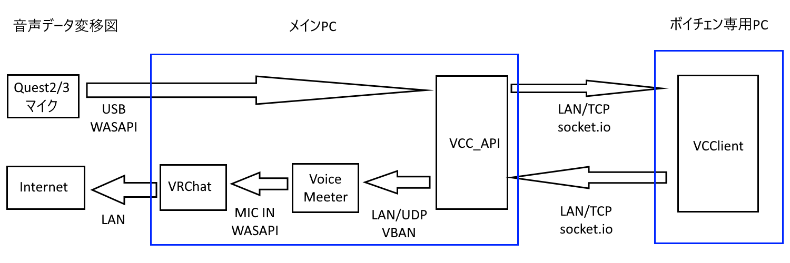
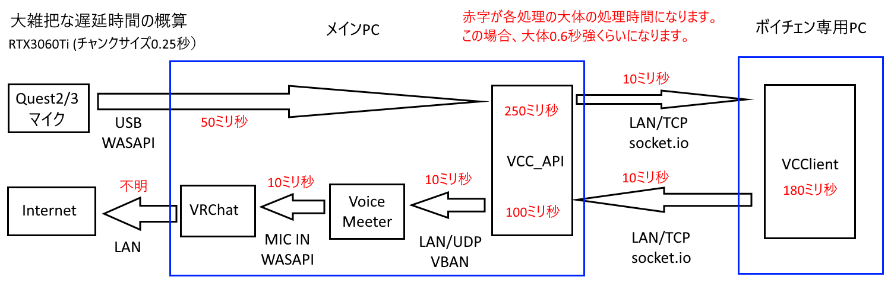
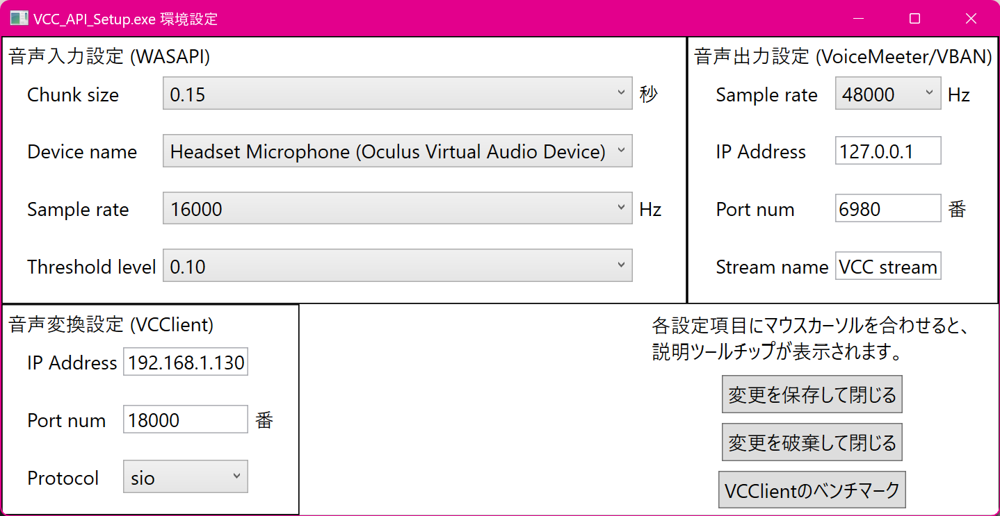
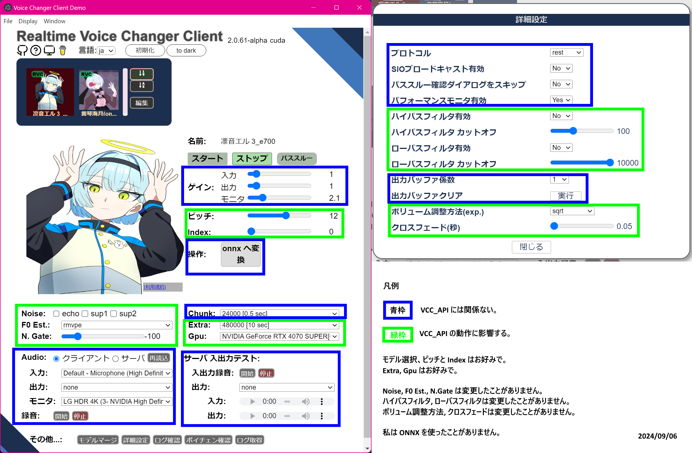
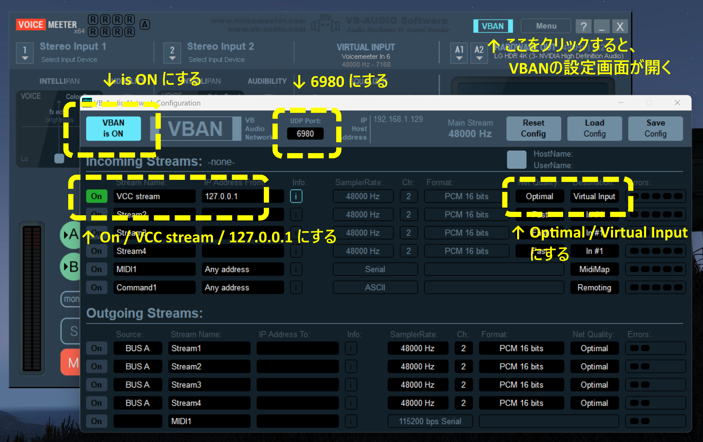

# VCC_API

ハードウェアインターフェースを使わずに、VCClient と Voice Meeter を使って、できるだけ低遅延で可愛い声になるためのサポートアプリです。  
1PC構成でも利用可能ですが、主に2PC構成を想定しています。

VCClient v.2.0.55-alpha以降  
https://github.com/w-okada/voice-changer/tree/v.2

Voicemeeterは、VoicemeeterでもBananaでもPotatoでも、VBANが使えればどれでも使用可能です。エフェクト等を使わないならVoicemeeterが一番シンプルでおすすめです。（Virtual Audio Cable不可）  
https://vb-audio.com/Voicemeeter/

YouTube VRChat と VCClient の、AIボイチェン遅延時間の聞き比べ

---

インストールとアンインストールについて

20240906_VCC_API.zip をダウンロードして展開し、VCC_API_Setup.exe で初期設定を済ませた後に、VCC_API.exe を実行してください。

レジストリなどは使用していませんので、アンインストールは展開したファイルを削除するだけでOKです。

---

VCC_API の設定について

おそらく変更が必要な点は4カ所です。

1. 音声入力設定: Chunk size  
音声処理単位時間指定（0.05秒未満にはできません）  
この数値が最も大きく遅延に影響します。  
小さい方が遅延が少なくなりますが、小さくしすぎてGPUが足りなくなると、逆に遅延が大きくなります。  
VCClientのベンチマークで大雑把な数値を調べることが出来ます。

1. 音声入力設定: Device name  
音声入力デバイス指定  
個人的には Oculus Virtual Audio Device が、VRChat向きかなと思います。

1. 音声入力設定: Threshold level  
音声入力の無音判定レベル指定  
指定レベル以下が3秒間続くと蓄積遅延リセットします。  
指定レベル以下が1分間続くと変換処理を一時停止します。  
パソコン用マイク使用時は0.1くらいで使用していますが、  
Questマイク使用時は0.01くらいでも大丈夫でした。  
喋り終わったときの蓄積遅延リセットが働く程度に小さい値にしてください。

1. 音声変換設定: IP Address  
VCClientのIPアドレス設定  
2PC構成の時は、IPアドレスを調べて入力してください。  
1PC構成の時は 127.0.0.1 でOKです。

VCC_API.exe の画面に！マーク（びっくりマーク）が不定期に多数表示されたときは、プチノイズが発生していますので、チャンクサイズを大きくしてください。  
無音判定から3秒後に蓄積遅延リセットするときにも！マークが表示されますが、元々無音状態なので問題ありません。

---

VCClient の設定について

クライアントモードで正常に可愛くなれているなら、基本的にそのままで大丈夫なはずです。

---

Voice Meeter の設定について

Voice Meeter は、管理者権限で起動してください。  
右上のVBANボタンをクリックすると、VBAN設定画面が開きます。  
基本的に、スクリーンショットの通りで大丈夫だと思います。

---

Quest Link の設定について

特に設定は必要ありませんが、私はSteam版VRChatを使用していません。

---

私が使った範囲でのTips

1. WiFi接続はとても遅延が大きいです。ボイチェンを使うときだけは、Air Link や、Virtual Desktop 等を使わず、USBとLANを使った方がいいかもしれません。
1. LAN内で他のパソコンが大量にデータ送受信すると、socket.io の遅延のばらつきが大きくなります。速いときも遅いときもあるなーと思ったら、LANカードを増設してクロス…（以下略
1. 遅延よりもプチノイズや音飛びの方が、より会話を阻害します。チャンクサイズはギリギリを狙わない方が無難です。
1. ボイチェンするだけ、と思うとCPUは関係なさそうですが、思ったよりもCPUパワーも影響します。i5-10400だと、RTX4070Superを若干持て余してしまう感じでした。
1. CPU選定傾向としては、4コア4スレッドでも40%弱しか使用していないので、コア数が多いCPUよりも、最大クロック数が高いCPUのほうが、結果的に速くなりやすそうです。
1. CPUだけを変えて、i5-7500T と i7-7700K を比較してみました。思った以上に差は歴然でした。VCC_API_Benchmark フォルダを参照してください。

---

音が出ないときは1から順に確認してみてください。

1. VCC_API.exe の画面に特段変化がないときは、VCC_API_Setup.exe の「音声入力設定: Device name」と「音声入力設定: Threshold level」を確認してください。
1. VCClientのコンソール画面で、Elapsed Time(sec)が変化しないときは、VCC_API_Setup.exe の「音声変換設定: IP Address」を確認してください。  
VCClient を「 main.exe cui --https false --no_cui false 」で起動しないと数字が見えないかもしれません。
1. Voice Meeter の「VIRTUAL INPUT」のレベルゲージが動かないときは、上段の「Voice Meeter の設定について」を確認してください。
1. VRChat内の左下のマイクが反応しない（透明のまま）ときは、VRChat の Microphone の「CURRENT DEVICE」を確認してください。  
基本的には「Voicemeeter Out A1」または「Voicemeeter Out B1」がマイク入力になります。
1. これでも出なかったらVCC_APIのバグだと思うので、状況を教えて頂けると助かります。

---

既知の問題

RVCv1モデルが読み込めない問題を修正中です。  
音楽とタイミングを合わせて歌えるように。

---

履歴

2024/09/06 初版

